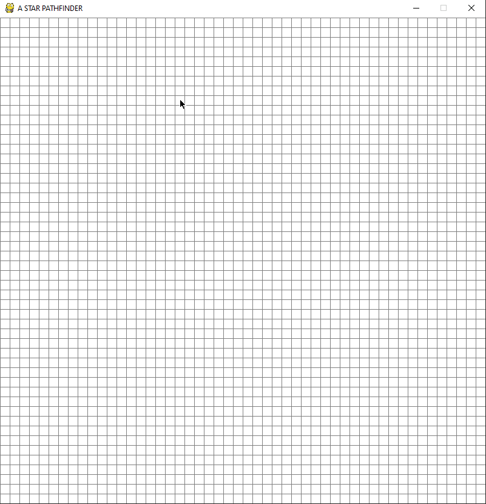

# a-star-search

## Description

A-star-search is a simple program that visualizes the A* search algorithm using Pygame. Users can interact with the program by selecting a start point, end point, and various kinds of barriers to manipulate the 800x800 environment. Based on this environment, the program will then use the A* pathfinding algorithm to calculate a path with the shortest distance (Manhatten Distance) from the start point to the end point. The final path will be shown in purple, and users can reset the grid to begin a new search.

## Basic Instructions

The program has four main keys:

1. **Left Click**

   - The first and second click will set the start (orange) and end point (blue), respectively. Any click after these two points will considered as barriers (black). You can also click and drag to draw the barriers.

2. **Right Click**

   - Right clicking on the a point will reset it to a null value (White). You can use this to undo your drawings or change the start/end points.

3. **Space Bar**

   - After you have completed manipulating the environment, you can press the space bar for the program to begin searching. You won't be able to make any changes while the program is running.

4. **Key 'c'**

   - Pressing the 'c' key on your keyboard will undo all the changes you have made and reset the grid.

## Installation

Make sure you are using Python 3 versions (I used Python 3.7.2).

```bash
python --version
```

You also need to install Pygame version 1.9.6.

```bash
pip install pygame==1.9.6
```

## Usage

Firstly, clone the a-star-search repository to your desired directory.

```bash
git clone https://github.com/byunsy/a-star-search
```

In the directory you have cloned the repository, execute the program in the source directory. This will open up a separate Pygame window automatically.

```bash
python astar.py
```

## Demonstrations

Visualization of A\* search algorithm.


